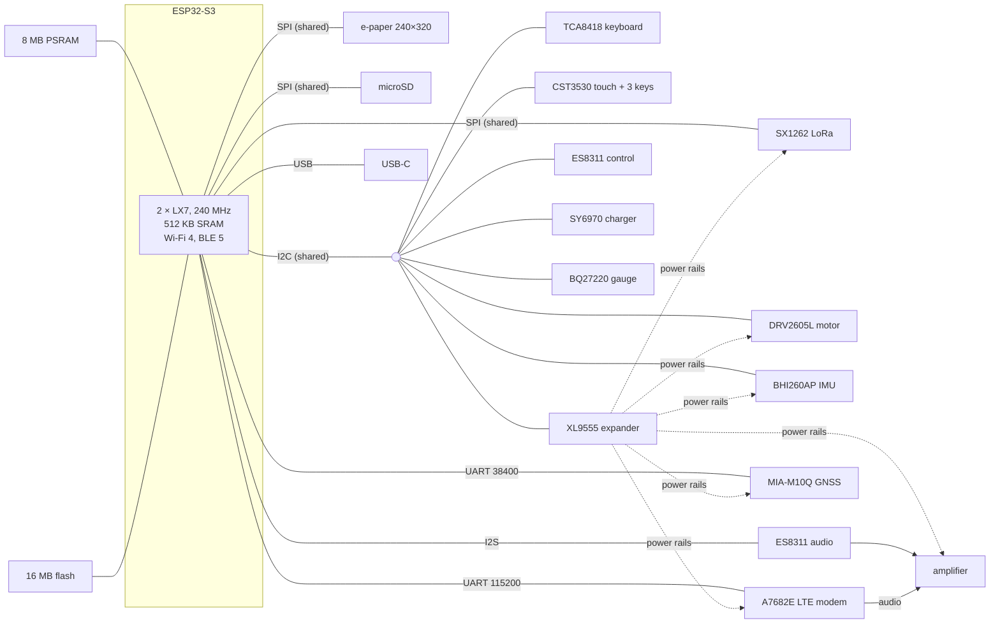

# LilyGo T-Deck Max

- **Status:** draft
- **Last changed:** 2026-09-28

The device pnut-os runs on today, described for the people designing the
system: what it has, how the parts are connected, what was measured, and
what that means for the software. Pins, registers and driver details are
in the board's NuttX documentation (see the end).

## Overview

The T-Deck Max is a pocket handheld from LilyGo: an ESP32-S3 with a 3.1"
e-paper screen, a BlackBerry-style thumb keyboard, three touch keys under
the screen, an LTE modem, a LoRa radio, GNSS, audio, a vibration motor and
a 1400 mAh battery. Nearly every part sits on a power rail that the
software switches, through an I/O expander.

## Components

| Part | Job | Connected by |
|---|---|---|
| ESP32-S3 (dual Xtensa LX7, 240 MHz) | the processor; also 2.4 GHz Wi-Fi 4 and Bluetooth LE 5 | — |
| 8 MB PSRAM (quad SPI) | most of the working memory | the ESP32-S3's memory bus |
| 16 MB flash (quad SPI) | firmware and storage | the ESP32-S3's memory bus |
| GDEQ031T10 e-paper, 240 × 320, 1 bit (UC8253 controller) | the screen | SPI |
| Front light (LEDs, PWM) | lights the screen | GPIO 41 |
| CST3530 touch controller | the touch panel, and the three touch keys under it (heart, chat bubble, arrow) | I2C |
| TCA8418 keyboard controller, 4 × 10 matrix | the thumb keyboard (BlackBerry Q20 layout) | I2C |
| Keyboard backlight (PWM) | lights the keyboard | GPIO 42 |
| Side buttons | RST resets the chip; BOOT (GPIO 0) is free for the software (a power key) | GPIO |
| A7682E (SIMCom) | LTE Cat 1 modem: LTE-FDD bands 1, 3, 5, 7, 8, 20 and GSM 900/1800; voice (VoLTE) and SMS | UART (115200 baud), ring indicator and DTR lines; its own USB only on test pads |
| SX1262 | LoRa radio, 868 MHz version (863–870 MHz, −9 to +22 dBm), internal or external antenna by a switch | SPI |
| MIA-M10Q (u-blox) | GNSS receiver: GPS, GLONASS, Galileo, BeiDou | UART (38400 baud) |
| ES8311 | audio codec: speaker and microphone | I2S, and I2C for control |
| Audio amplifier | drives the speaker; its input is switched between the codec and the modem | power rail and a selector line |
| DRV2605L | vibration motor driver (ERM) | I2C |
| BHI260AP | motion sensor hub (IMU) | I2C |
| SY6970 | battery charger from USB | I2C |
| BQ27220 | battery fuel gauge | I2C |
| 1400 mAh Li-Po cell | the battery | — |
| microSD slot | removable storage | SPI |
| XL9555 | I/O expander: switches the modem, LoRa, GNSS, IMU, motor and amplifier rails, and the modem's power key, resets and selectors | I2C |
| USB-C | power and charging; the ESP32-S3's USB (serial console and JTAG, or USB device) | USB |

Support in pnut-os is not listed per part yet: the specification is being
written from the beginning, and support will be added here as it is
designed.

## Block diagram

## Memory and storage

- **Internal RAM** is the scarce resource. The ESP32-S3 has 512 KB. With
  Wi-Fi and Bluetooth built in, the kernel's share (its heap, which the
  radios' drivers also need) is about **151 KB**, of which about **44 KB**
  is free in normal use and about **16 KB** with Wi-Fi and mobile data up at
  once (measured 2026-09-26 to 2026-09-28).
- **PSRAM**, 8 MB, is the rest of the working memory: about 0.9 MB is used
  with the whole system running (2026-09-27).
- **Flash**, 16 MB, is split **4 / 4 / 1 / 7 MB**.
- **microSD** for bulk data.

## Power

Measured on battery, with the fuel gauge, which reports whole milliamps.

| State | Draw | Measured |
|---|---|---|
| Awake and idle (the processor at 80 MHz between tasks, 240 MHz when working) | 28 mA | 2026-09-21/22 |
| Idle in light sleep, radios off | 3 mA (about 19 days on a full cell) | 2026-09-22 |
| The same, later boots | 5, 10 and 7–8 mA (not explained yet) | 2026-09-26/27 |
| Light sleep with LoRa listening (MeshCore) | 13 mA | 2026-09-26 |
| The modem on and idle on LTE | about 48 mA (about 1.2 days) | 2026-09-26 |
| The modem on and asleep too | 18–20 mA, but see below | 2026-09-26 |

- **Light sleep** keeps memory and state, and wakes on timers, keys, touch,
  the LoRa radio and the modem's ring indicator. It is held off while USB
  power is present, a backlight is on, the GNSS, modem or amplifier rail is
  on, or Wi-Fi or Bluetooth has been started.
- **No 32 kHz crystal:** time asleep is kept by the internal RC oscillator
  (it gained 1.83 s over 3 h 51 min asleep, +132 ppm; 2026-09-22).
- The battery, charger and gauge are powered by the cell, so they keep
  their settings across resets of the processor.

## Constraints for the software

- **The screen is e-paper.** A full refresh takes **1.0 s**, a partial one
  (only the part that changed) **0.7–0.8 s** (measured 2026-09-21). Nothing animates; each decision
  should cost one redraw; lists page rather than scroll; typing is drawn in
  batches.
- **Internal RAM is tight** (above): anything that needs internal RAM
  (drivers, the kernel's stacks and buffers, the radios) competes for about
  150 KB.
- **The SPI bus is shared** by the screen, the LoRa radio and the SD card,
  and **the I2C bus** by the keyboard, touch, expander, charger, gauge,
  codec control, motor and IMU: one slow user delays the others.
- **One USB port:** the ESP32-S3's USB is either the serial console and JTAG
  or a USB device (such as adb), not both at once.
- **The modem is behind a 115200-baud UART.** Commands and mobile data
  share it (multiplexed); data reaches **70–80 kbit/s** (2026-09-26).
- **The modem switches itself off on GSM.** A call that falls back from LTE
  to GSM stops the modem (most likely its supply sagging on the GSM
  transmit bursts), so calls need voice over LTE, which the operator must
  allow for the line (verified with T-Mobile Polska, 2026-09-28).
- **The modem keeps some settings across power cycles** (network mode,
  bands): the software must set them at every start.
- **The modem's own sleep is unreliable** with the processor asleep: it
  misses commands (2026-09-26).
- **The LoRa radio listens on one configuration at a time,** so only one
  mesh network (MeshCore or Meshtastic) can use it at once.
- **The external LoRa antenna must be selected when fitted:** an unselected
  external antenna detunes the internal one by about 15 dB (2026-09-22).
- **GNSS** has not got a position fix yet: it was only tried indoors,
  where it saw one satellite, during bring-up. u-blox's typical cold start is
  about 30 s under open sky; not measured here.
- **The charger is set by the software** at every start (4288 mV,
  1024 mA, the vendor's values); 4288 mV is above the usual 4.20 V, and the
  cell's rating is not documented.

## Known problems

- **Idle current varies between boots** (3 to 10 mA in light sleep with the
  same software) and is not explained; the gauge's resolution is too coarse
  to find why, so it needs a meter in series with the battery.
- **The modem's sleep** (above) is off until the missed commands are
  understood.
- **Calls on GSM** stop the modem (above).

## Where the details are

- The board's page in the NuttX tree: pins, power rails, the drivers and
  how each part was brought up
  (`Documentation/platforms/xtensa/esp32s3/boards/lilygo-tdeck-max/`).
- LilyGo's repository: schematics, the vendor pin map and datasheets,
  <https://github.com/Xinyuan-LilyGO/T-Deck-MAX>.
